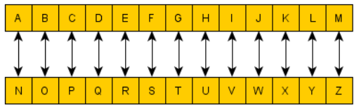
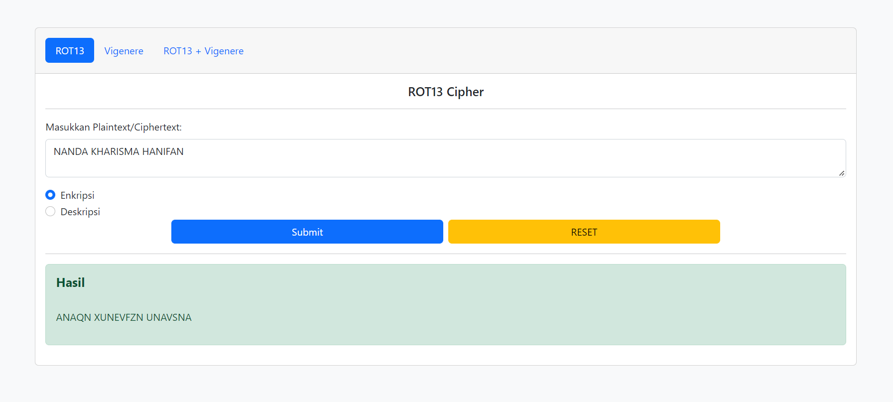
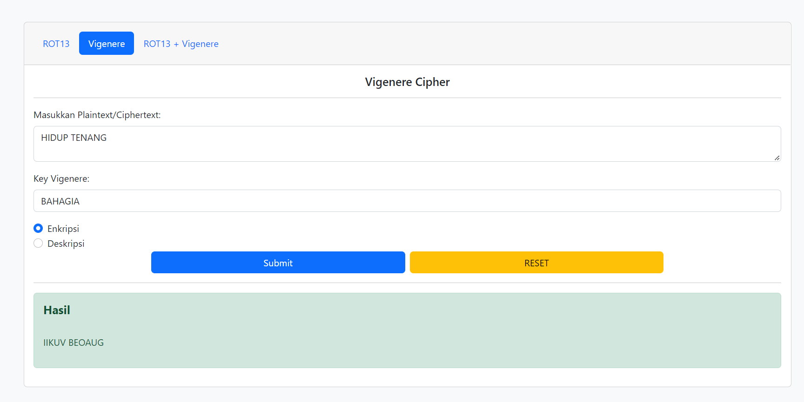

# Project Kriptografi
## Kalkulator ROT13 + Vigenere (Web Based)

### Nama Kelompok:
* 140810200015 Nanda Raihan Sukma
* 140810200047 Kharisma Fitri Nurunnisa Siahaan
* 140810200065 Hanifan Ayusti Khairunnisa

### ROT-13 dan Vigenere Cipher
#### ROT-13
> ROT-13 merupakan algoritma enkripsi sederhana yang menggunakan sandi abjad tunggal dengan pergeseran K=13.

#### Vigenere
> Vigenere Cipher merupakan sebuah bentuk polyalphabetic cipher, dimana akan dilakukan beberapa substitusi alfabet. Proses enkripsi manual umumnya memanfaatkan Vigenere Table/Square. Proses enkripsi menggunakan Plain Text & Key. (Key pada kasus ini merupakan text lain, bukan angka)

#### Screenshot Web
* ROT-13

* Vigenere

* ROT13 + Vigenere

